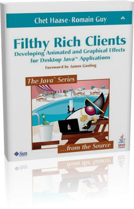

# Filthy Rich Clients

This repository hosts all the code examples from the
book called Filthy Rich Clients, written by Chet Haase
and Romain Guy.

All the examples are licensed under a 3-clause BSD
license.

You can find more information about the book here: [filthyrichclients.org (Archive)](
https://web.archive.org/web/20220118193103/http://filthyrichclients.org/)
(The original site is no longer available after Jan 18th 2022.)



> **Introduction to Filthy Rich Clients**
> 
> Filthy rich clients are applications that are so graphically rich that they ooze cool. 
> They suck the user in from the outset and hang onto them with a death grip of excitement.
> They make the user tell their friends about the applications.
> In short, they make the user actually enjoy their application experience. When was the 
> last time you enjoyed using a software application? Maybe you need more 
> Filthy Rich Clients in your life.
> 
> In _Filthy Rich Clients_, we explain how to create filthy rich effects in your applications,
> from the fundamental graphics, GUI, and animation technology up through sample code and 
> algorithms for the effects themselves.
> 
> Some of the topics covered in-depth include:
> 
> * Graphics and GUI fundamentals: Dig deep into the internals of how Swing and Java 2D
>   work together to display GUI applications on the screen. Learn how to use these libraries 
>   correctly and effectively.
> * Performance: Follow in-depth discussions and tips throughout the book that will help 
>   you learn how to write high-performing GUI applications.
> * Images: Understand how images are created and used to make better Java applications.
> * Advanced Graphics: Find out about elements of Swing and Java 2D that may not be in 
>   common use but that filthy rich clients benefit from greatly.
> * Animation: Discover general concepts of animation, as well as how to use the facilities 
>   provided in the Java platform. Learn about new utilities that vastly simplify animations 
>   in Java.
> * Effects: Learn how to create and use static and animated effects that are the mainstay 
>   of filthy rich clients.
> * Every chapter is filled with code examples which come directly from demos and libraries 
>   posted on this web site.
> 
> Read the book. Run the demos. Understand the code. Write some filthy rich clients of 
> your own. Your users will thank you!
>                                 
> <details><summary><strong>Outline</strong></summary>
> 
> Filthy Rich Clients covers many graphics-related topics. The following outline describes 
> the structure of the book and gives you a clear description of its content:
> 
> * Part I, Graphics and GUI Fundametals
>   * Desktop Java Graphics APIs: Swing, Java 2D, and AWT
>   * Swing Rendering Fundamentals
>   * Graphics Fundamentals
>   * Images
>   * Performance
> * Part II, Advanced Graphics Rendering
>   * Composites
>   * Gradients
>   * Image Processing
>   * Glass Pane
>   * Layered Panes
>   * Repaint Manager
> * Part III, Animation
>   * Animation Fundamentals
>   * Smooth Moves
>   * Timing Framework: Fundamentals
>   * Timing Framework: Advanced
> * Part IV, Effects
>   * Static Effects
>   * Dynamic Effects
>   * Animated Transitions
>   * Birth of a Filthy Rich Client
> 
> </details>
> 
> <details><summary><strong>Errata</strong></summary>
> 
> Despite our efforts the book is not perfect and your edition might contain 
> a few mistakes or it might lack a piece of information. This section contains 
> corrections for some chapters.
> 
> **Chapter 2**
> 
> Figure 8 is wrong. The explicit call to `process(V...)` should be a call to `publish(V...)`. You can [download the correct figure](book/errata/chapter2-figure8.png).
> 
> **Chapter 4**
> 
> On page 111, note that the `getFasterScaledInstance()` was only intended for 
> downscaling images. If you use the method as written for up-scaling, you may 
> hit an infinite loop problem. The workaround is simple (don't got into the 
> `if (progressiveBilinear)` block if the `targetWidth` or `targetHeight` are 
> greater than the current `width`/`height` values. Or simply don't use this method 
> for up-scaling.
> 
> **Chapter 6**
> 
> One page 155, `resultG` and `resultB` should be calculated with `srcG` and `srcB`,
> respectively (they incorrectly use `srcR` in the example code.)
> 
> On page 173, the `createContext()` should return an `AddContext` instead of a `BlendingContext`.
> 
> On page 174, the last paragraph should read _To implement the `AddContext` [...]_.
> 
> On page 176, the last paragraph should refer to `srcPixelsArray` and `dstPixelsArray` instead of `srcPixels` and `dstPixels`.
> 
> **Chapter 18**
> 
> **Effect memory leak**
> 
> In order to address a memory leak that comes from adding (but never removing) 
> `PropertySetters` to the `Animator` used for `ScreenTransition`, there is 
> a new method in `Effect`:
>                         
> ```java
> public void cleanup(Animator animator);
> ```
> 
> This method is a parallel to the existing `init(Animator)` method, only this one 
> is called after the transition is complete, and gives the `Effect` a chance to 
> clean up after itself (such as removing targets from the `Animator`). For example, 
> the supplied `Move` effect adds a `PropertySetter` to `ScreenTransition`'s `Animator`
> object in its `init` method:
> 
> ```java
> PropertySetter ps;
> public void init(Animator animator, Effect parentEffect) {
>   Effect targetEffect = (parentEffect == null) ? this : parentEffect;
>   ps = new PropertySetter(targetEffect, "location",
>       new Point(getStart().getX(), getStart().getY()),
>       new Point(getEnd().getX(), getEnd().getY()));
>   animator.addTarget(ps);
>   super.init(animator, null);
> }
> ```
> 
> The `cleanup` method, then, is responsible for removing `ps` after the transition is complete:
>                 
> ```java
> @Override
> public void cleanup(Animator animator) {
>   animator.removeTarget(ps);
> }
> ```
> 
> You may not need to use this method, or know about this detail at all, in your animated
> transition code. But if you define any custom effect (such as the `MoveIn` effect in the
> `SearchTransition` demo) then you may need to override `cleanup()` to avoid memory leaks.
> 
> **Cleaning Out EffectsManager**
> 
> `EffectsManager` makes it possible to set custom effects for an application, but 
> not (until now) to remove those effects. You could set an effect for a component 
> to `null`, but you could not actually remove the component from the cached list 
> of components with associated effects.
> 
> To fix this, `EffectsManager` now has three new methods:
>               
> ```java
> public static void removeEffect(JComponent component,
>                                 TransitionType transitionType);
> public static void clearEffects(TransitionType transitionType);
> public static void clearAllEffects();
> ```
> 
> `removeEffect()` removes a single effect associated with a component and `transitionType`,
> `clearEffects(transitionType)` clears all effects for a given transition type,
> and `clearAllEffects()` clears all effects regardless of the transition type.
> 
> </details>

## Moved project descriptor to Gradlew

The original code required an old Netbeans distribution; also the projects
had jars directly under the project structure (under `lib/`), sources and resources
under the same `src` folder. And finally, the java version ranged from 1.4 to 1.6.

This fork is now configured with Gradle, using standard Java project structure
(`src/main/java`, `src/main/resources`), as well as the latest Java version: 20.

Note, however, dependency sources were on the defunct http://java.net, and are hard
to come by in the same version. For now the jars are left in place.

Now one can run an example this way

```bash
./gradlew :AnimatedTransitions:ImageBrowser:run
```

To discover the available projects, use

```bash
./gradlew projects
```

